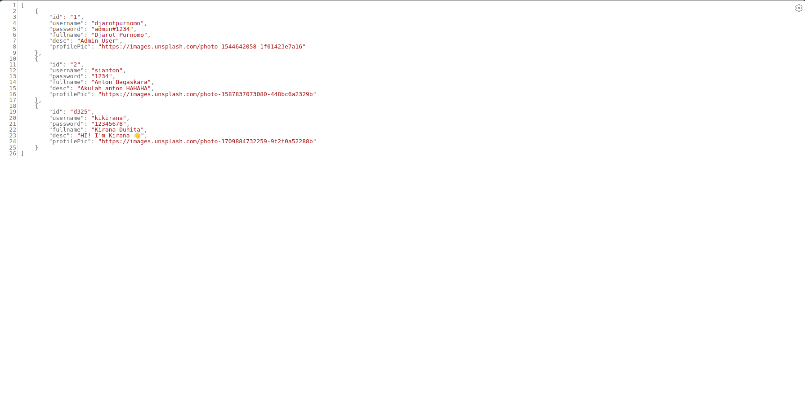
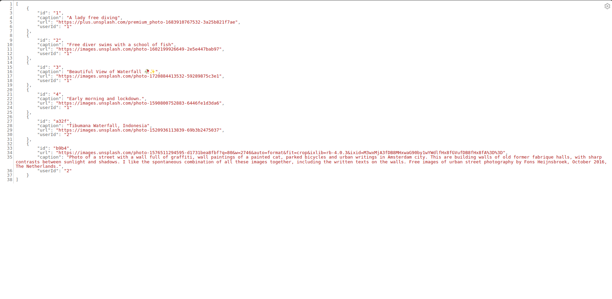
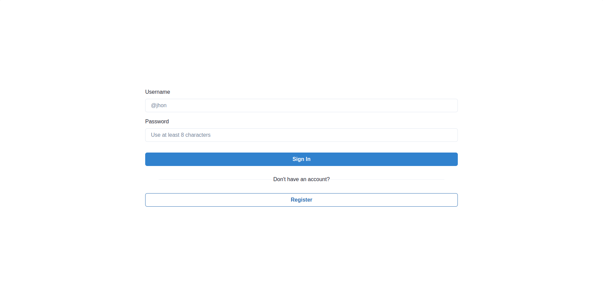
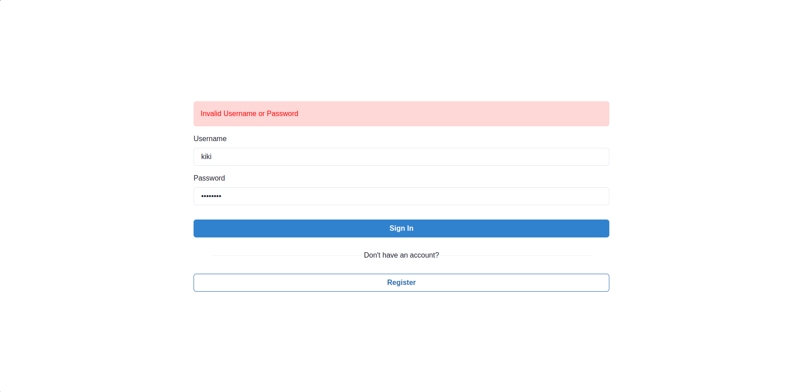
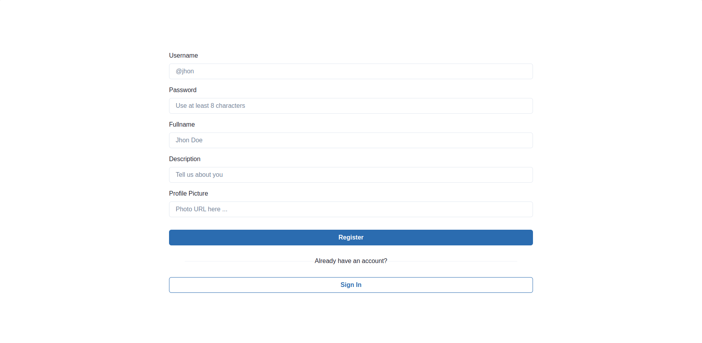
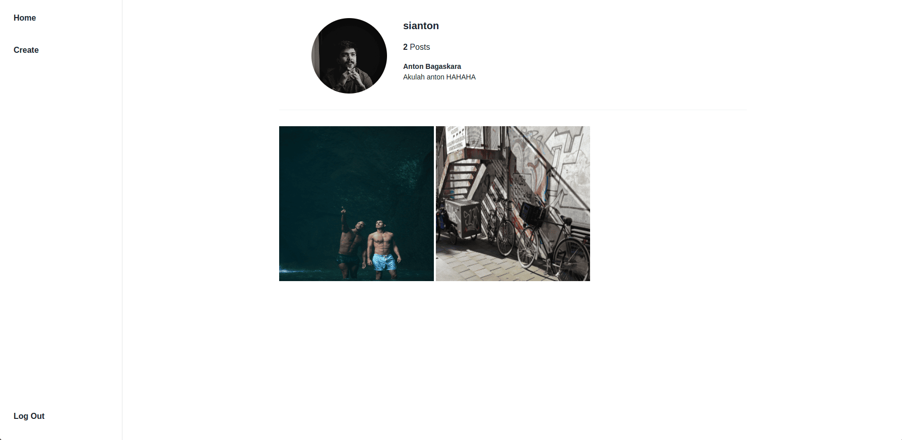
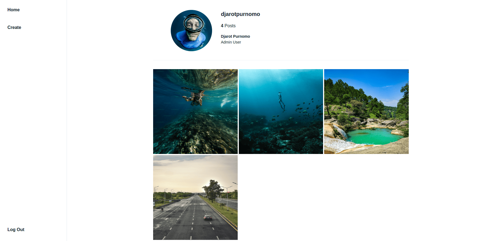
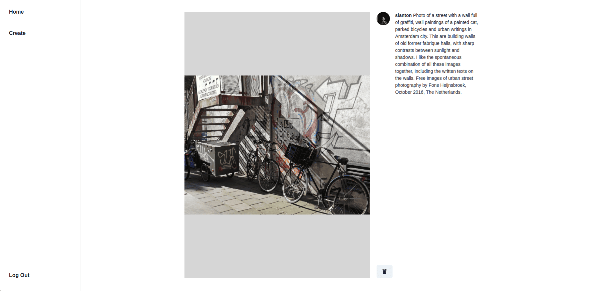
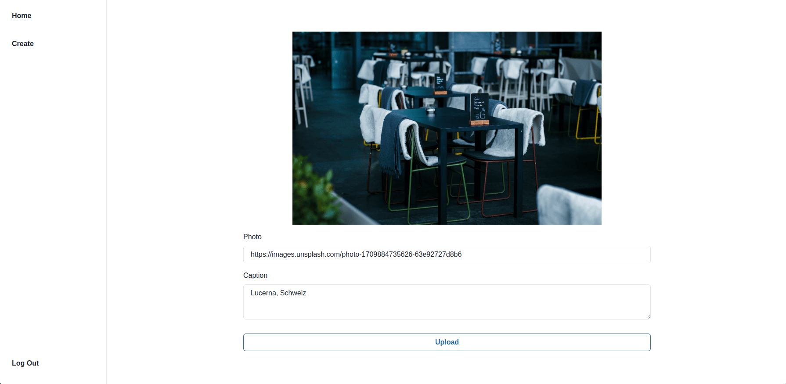
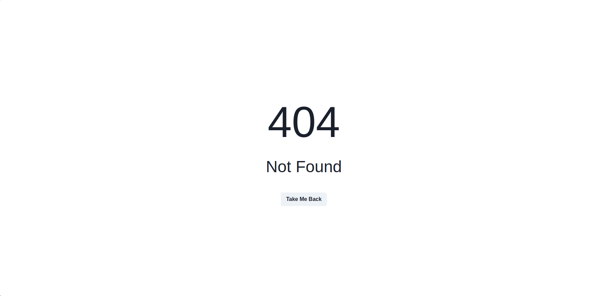

# Hacktogram

## Final Course Project

### NOTES

-   Pada skeleton kode yang terdapat file `App.test.js` tidak boleh diubah sama sekali.
-   Dilarang mengganti nama function yang diberikan.
-   Dilarang mengganti atau mengutak-atik file pada folder `server`.
-   Wajib menjalankan `npm install` atau `pnpm install` sebelum mengerjakan final project.

### Description

Pada Final Project ini kalian diminta untuk melanjutkan pembuatan sebuah halaman _web_ _Hack-to-gram_ (**Instagram clone lite version**). Yang perlu kalian lakukan adalah membuat beberapa fitur pada halaman _web_ kalian, antara lain:

-   Membuat halaman _Register_.
-   Membuat halaman _Sign In_.
-   Membuat _protected route_.
-   Membuat halaman _Home_.
-   Membuat halaman untuk menampilkan seluruh data _photo_ yang dimiliki oleh _user_ yang berhasil _Sign In_.
-   Membuat halaman untuk menampilkan detail _photo_.
-   Membuat halaman untuk menambahkan _photo_ _user_.
-   Membuat halaman untuk merender komponen "**Page not found**".

> Kalian diwajibkan menggunakan komponen dan library _Chakra UI_.

### `json-server`

Kalian diberikan juga sebuah file `json-server` dengan nama `db.json` dalam folder `/server` sebagai _server_ kalian.

> Server dapat di jalankan menggunakan command `npm run start:server` dan akan berjalan pada `http://localhost:3001/`.

-   Untuk mengakses _server_ `users` pada browser dapat kalian lakukan melalui URL `http://localhost:3001/users`.
    
-   Untuk mengakses _server_ `photos`pada browser dapat kalian lakukan melalui URL `http://localhost:3001/users`.
    

Berikut ini beberapa endpoint dari `json-server` yang dapat kalian akses:

```
GET /users
POST /users
GET /photos
GET /photos/id
DELETE /photos/id
```

Berikut beberapa dokumentasi _external_ yang dapat kalian akses dan membantu kalian saat mengerjakan _final project_ ini:

-   [json-server](https://www.npmjs.com/package/json-server)
-   [Fetch API](https://developer.mozilla.org/en-US/docs/Web/API/Fetch_API/Using_Fetch)

### `App.js`

Pada file ini, kalian diminta untuk membuat sebuah _component_ yang akan menampilkan semua _route_ yang ada pada _app_ kalian. Berikut ini beberapa _route_ yang perlu kalian buat:

-   `Route` dengan path "`/`":

    -   Ini adalah _route_ utama atau _root path_ dari aplikasi. _route_ ini menjalankan `ProtectedRoute` yang berarti hanya pengguna ter-_authenticated_ yang bisa mengaksesnya.

    -   Di dalam _route_ ini ada 3 sub-_route_ atau _nested route_:

        -   _Route_ `index` yang akan merender komponen `Photos` jika pengguna mengunjungi path "`/`". _route_ `index` digunakan untuk merender sesuatu pada URL yang sama dengan _route_ induknya.

        -   _Route_ dengan path "`/create`", yang berarti jika pengguna mengunjungi "`/create`", _route_ ini akan merender komponen `CreatePhoto`.

        -   _Route_ dengan parameter "`:id`". Sehingga jika pengguna mengunjungi suatu URL seperti "`/photo/1`", _route_ ini akan merender komponen `Detail` dan "`:id`" akan menjadi `1`.

-   _Route_ dengan path "`/signin`". Jika pengguna mengunjungi "`/signin`", _route_ ini akan merender komponen `SignIn`.

-   _Route_ dengan path "`/register`". Jika pengguna mengunjungi "`/register`", _route_ ini akan merender komponen `Register`.

-   _Route_ dengan path "`*`". Tanda "`*`" berarti semua path yang tidak didefinisikan dalam `Routes` akan merender komponen `NotFound` yang biasanya digunakan sebagai halaman error 404 atau "Page not found".

### `ProtectedRoute.jsx`

Pada _component_ ini kalian diminta untuk membuat sebuah _component_ yang akan mengecek apakah pengguna ter-_authenticated_ atau tidak.

-   Jika _user_ ter-authenticated, _component_ ini akan merender komponen _Home_.
-   Jika _user_ tidak ter-authenticated, maka _user_ akan diarahkan ke halaman _Sign In_

Kalian dapat melakukan mengimplementasikan _component_ ini dengan cara mengecek apakah terdapat data _user_ dalam _localStorage_.

### `SignIn.jsx`



> Silahkan lakukan styling dengan kreatifitas yang kalian miliki.

Pada _component_ ini kalian diminta untuk membuat _form_ dengan kriteria berikut:

1. _Component_ ini harus memiliki _attribute_ `className` dengan _value_ `signin-page`.

2. Terdapat beberapa hal yang perlu kalian buat dan tambah di _form_ kalian, antara lain:

    - `username` : menggunakan komponen Chakra UI `Input` dan memiliki _attribute_ `data-testid` dengan _value_ `username`.
    - `password` : menggunakan komponen Chakra UI `Input` dan memiliki _attribute_ `data-testid` dengan _value_ `password`.
    - _Button form_ `Sign In`: menggunakan komponen Chakra UI `Button` dan memiliki _attribute_ `data-testid` dengan _value_ `signin-button`.
    - _Button form_ `Register`: menggunakan komponen Chakra UI `Button` dan memiliki _attribute_ `data-testid` dengan _value_ `register-button`.

3. Terdapat beberapa _field_ data yang di _submit_ lalu di dicek pada `json-server`.

    | Name       | Data Type |
    | ---------- | --------- |
    | _username_ | string    |
    | _password_ | string    |

4. Setiap kali _form_ di _submit_ maka akan mengecek apakah user dengan _username_ dan _password_ yang diinputkan sudah terdaftar.

    - Jika _user_ tidak terdaftar, maka _user_ akan terdapat pesan error `Invalid Username or Password`.

        

    - Jika _user_ terdaftar, maka data _user_ akan disimpan pada _localStorage_ dan _user_ akan diarahkan ke halaman _Home_.

5. Button _Register_ akan mengarahkan _user_ ke halaman _Register_.

### `Register.jsx`



> Silahkan lakukan styling dengan kreatifitas yang kalian miliki.

Pada _component_ ini kalian diminta untuk membuat _form_ dengan kriteria berikut:

1. _Component_ ini harus memiliki _attribute_ `className` dengan _value_ `register-page`.

2. Terdapat beberapa hal yang perlu kalian buat dan tambah di _form_ kalian, antara lain:

    - `username` : menggunakan komponen Chakra UI `Input` dan memiliki _attribute_ `data-testid` dengan _value_ `username`.
    - `password` : menggunakan komponen Chakra UI `Input` dan memiliki _attribute_ `data-testid` dengan _value_ `password`.
    - `fullname` : menggunakan komponen Chakra UI `Input` dan memiliki _attribute_ `data-testid` dengan _value_ `fullname`.
    - `description` : menggunakan komponen Chakra UI `Input` dan memiliki _attribute_ `data-testid` dengan _value_ `description`.
    - `profile-picture` : menggunakan komponen Chakra UI `Input` dan memiliki _attribute_ `data-testid` dengan _value_ `profile-picture`.
    - _Button form_ `Register`: menggunakan komponen Chakra UI `Button` dan memiliki _attribute_ `data-testid` dengan _value_ `register-button`.
    - _Button form_ `Sign In`: menggunakan komponen Chakra UI `Button` dan memiliki _attribute_ `data-testid` dengan _value_ `signin-button`.

3. Terdapat beberapa _field_ data yang di _submit_ lalu di tambahkan kedalam `json-server`.

    | Name              | Data Type |
    | ----------------- | --------- |
    | _username_        | string    |
    | _password_        | string    |
    | _fullname_        | string    |
    | _description_     | string    |
    | _profile-picture_ | string    |

4. Setiap kali _form_ di _submit_ maka akan meng-_create_ _user_. Lalu, data _user_ akan disimpan pada _localStorage_ dan _user_ akan diarahkan ke halaman _Home_.

5. Button _Sign In_ akan mengarahkan _user_ ke halaman _Sign In_.

### `Home.jsx`



> Silahkan lakukan styling dengan kreatifitas yang kalian miliki.

Pada _component_ ini kalian diminta untuk membuat _Side Bar_ dan juga sebuah _component_ `Outlet` dari `react-router-dom` untuk menampilkan halaman _component_ _sub-route_.

Beberapa button yang perlu kalian tambahkan di _Side Bar_ antara lain:

-   _Button_ `Home`: menggunakan komponen Chakra UI `Button` dan memiliki _attribute_ `data-testid` dengan _value_ `home-button`. Setiap kali di klik, _Button_ ini akan mengarahkan _user_ ke halaman _Home_.
-   _Button_ `Create`: menggunakan komponen Chakra UI `Button` dan memiliki _attribute_ `data-testid` dengan _value_ `create-button`. Setiap kali di klik, _Button_ ini akan mengarahkan _user_ ke halaman _Create_.
-   _Button_ `Logout`: menggunakan komponen Chakra UI `Button` dan memiliki _attribute_ `data-testid` dengan _value_ `logout-button`. Setiap kali di klik, _Button_ ini akan menghapus _localStorage_ dan _user_ akan diarahkan ke halaman _Sign In_.

### `Photos.jsx`

Component _Photos_ adalah _sub-route_ dari _component_ _Home_ yang akan menampilkan semua _photos_ yang ada dan yang pertama kali ditampikan bersama _component_ _Home_.

Pada _component_ ini kalian diminta untuk melakukan beberapa hal:

1. _Component_ ini memiliki attribute `className` dengan _value_ `photos-page`.

2. Menampilkan data _user_ yang berhasil _signin_. Data user yang perlu ditampilkan anatara lain:

    - _Profile picture_
    - _Username_
    - _Fullname_
    - _Description_
    - dan Jumlah _Photo_ yang dimiliki (**mis. 2 Posts**)

3. Melakukan _fetch_ data dari `json-server` dan menampilakan semua _photos_ yang dimiliki oleh _user_ tersebut. _Photo_ akan langsung ditampilkan setiapkali halaman dirender.

    Pastikan hanya Photo dari _user_ yang berhasil signin yang ditampilkan. Perhatikan contoh _user_ dibawah ini:

    1. _Username_: `sianton`
       
    2. _Username_: `djarotpurnomo`
       

    Bila diperhatikan pada contoh diatas, setiap _user_ memiliki foto yang berbeda untuk ditampilkan berdasarkan dari `userId` yang dimiliki data setiap `photo` pada `json-server`.

4. Pastikan photo yang ditampilakan menggunakan _component_ _Chakra UI_ `Image` dan memiliki _attribute_ `alt` dengan _value_ berupa _caption_ dari _photo_ tersebut.

5. Jika data _photo_ masih dalam proses _fetch_ (belum siap ditampilkan), _component_ ini akan menampilkan `photo template` seperti dibawah ini.

    

    Setiap template _photo_ ini memiliki _attribute_ `className` dengan _value_ `photo-loading-template`.

6. Setiap kali photo di klik maka akan mengarahkan _user_ ke halaman _Detail_ dari _photo_ tersebut.

### `Detail.jsx`



> Silahkan lakukan styling dengan kreatifitas yang kalian miliki.

Pada _component_ ini kalian diminta untuk melakukan beberapa hal:

1. _Component_ ini memiliki attribute `className` dengan _value_ `detail-photo-page`.

2. Menampilkan _profile picture_, _username_, _caption_ dan _photo_ dari _photo_ yang dipilih.

3. Membuat _button_ _delete_ _photo_ yang mana setiap kali _button_ di klik maka akan melakukan _delete_ data _photo_ berdasarkan `id` nya dan mengarahkan _user_ ke halaman _Home_.

### `CreatePhoto.jsx`



> Silahkan lakukan styling dengan kreatifitas yang kalian miliki.

Pada _component_ ini kalian diminta untuk membuat _form_ dengan kriteria berikut:

1. _Component_ ini harus memiliki _attribute_ `className` dengan _value_ `create-photo-page`.

2. Terdapat beberapa hal yang perlu kalian buat dan tambah di _form_ kalian, antara lain:

    - `Photo` : menggunakan komponen Chakra UI `Input` dan memiliki _attribute_ `data-testid` dengan _value_ `photo-url`.
    - `Caption` : menggunakan komponen Chakra UI `Textarea` dan memiliki _attribute_ `data-testid` dengan _value_ `caption`.memiliki _attribute_ `data-testid` dengan _value_ `profile-picture`.
    - _Button form_ `Upload`: menggunakan komponen Chakra UI `Button` dan memiliki _attribute_ `data-testid` dengan _value_ `upload-button`.

3. Terdapat beberapa _field_ data yang di _submit_ lalu di tambahkan kedalam `json-server`.

    | Name              | Data Type |
    | ----------------- | --------- |
    | _photo-url_       | string    |
    | _profile-picture_ | string    |
    | _userId_          | string    |

4. Setiap kali _form_ di _submit_ maka akan meng-_create_ _photo_. Lalu jika berhasil, user akan diarahkan ke halaman _Home_ dan _photo_ akan ditampilkan.

### `NotFound.jsx`

Pada _component_ ini kalian diminta untuk membuat komponen "**Page not found**", yang akan di tampilkan jika user memasukan url yang tidak kita handle dengan ketentuan berikut:

1. Terdapat pesan "**404 Not Found**".

2. Terdapat _button_ yang memiliki _attribute_ `data-testid` dengan _value_ `back` yang mana jika di klik akan mengembalikan **ke halaman sebelumnya**.



> Silahkan lakukan styling dengan kreatifitas yang kalian miliki.
